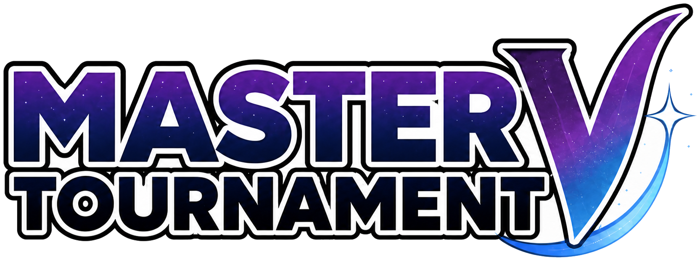

<p align="center">
  
</p>

# Master V Tournament

Aplicación de escritorio para acompañar partidas y torneos de Pokémon mediante información leída
en vivo desde un emulador compatible. Esta es la reescritura en **Java 21 + JavaFX** de la
[aplicación legacy](https://github.com/poke-mada/app).

El objetivo actual es ofrecer una interfaz local, rápida y predecible para Pokémon Sun/Moon:
equipo, combate, movimientos, efectividades y un historial automático de batalla. El proyecto sigue
en desarrollo; las secciones que todavía son conceptuales se identifican claramente como
*placeholder*.

## Estado actual

| Área | Estado | Descripción |
| --- | --- | --- |
| Conexión con MadaLime | Funcional | Transporte UDP con direcciones virtuales guest de Nintendo 3DS; las lecturas son la norma y Poke Vial es la escritura explícita aislada. |
| Pokémon Sun/Moon | Funcional | Perfil de memoria independiente para equipo, combate, textos y mochila. |
| LIVE | Funcional | Equipo del jugador, combate activo, sprites, PS y acceso al detalle. |
| Poke Vial | Funcional | Cura el equipo desde LIVE, consume cargas persistentes y se recarga tras una curación completa fuera de combate. |
| Combate individual | Funcional | Combatientes, equipos, stats base, tipos, movimientos y registro en vivo. |
| Historial de combate | Funcional | Guarda sesiones localmente y expone los tres combates anteriores. |
| Detalle de Pokémon | Funcional | Stats base/reales, tipos, habilidad, objeto, movimientos y efectividad defensiva. |
| Mochila | Funcional por CLI | Parser de solo lectura; todavía no tiene pantalla propia. |
| Cajas | Esqueleto | Navegación de 32 cajas; la lectura desde guardado está pendiente. |
| Showdown | Placeholder | Layout preparado; integración y cálculos avanzados pendientes. |
| Comodines | Placeholder | Catálogo visual preparado; falta la API de inventario. |
| Buzón | Placeholder | Tabla y estado vacío preparados; falta la cuenta del entrenador. |
| Ruletas | Placeholder visual | Portal gacha con identidad Master V; no realiza invocaciones todavía. |

> [!IMPORTANT]
> Las direcciones investigadas son exclusivas de las versiones soportadas de Pokémon Sun/Moon.
> No se reutilizan para Ultra Sun/Ultra Moon sin investigación independiente.

## Interfaz

### Navegación lateral

- **Logo Master V:** wordmark del evento actual.
- **Combates:** abre la pantalla LIVE.
- **Cajas:** almacenamiento del PC basado en guardados.
- **Showdown:** preparación y comparación futura de enfrentamientos.
- **Comodines:** inventario futuro de cartas/comodines.
- **Buzón:** recompensas y mensajes futuros.
- **Ruletas:** portal de invocaciones del torneo.
- **Estado de MadaLime:** el avatar pixel-art recupera color al conectarse. La conexión se muestra
  aquí, sin repetir indicadores en cada pantalla.

### LIVE

La pantalla LIVE es el resumen operativo de la partida.

- **Campo de batalla:** muestra si existe un combate y una vista compacta del rival. Solo es
  interactivo durante una pelea, evitando aperturas y regresos instantáneos fuera de combate.
- **Registro:** muestra exclusivamente los tres combates finalizados más recientes. Cada fila utiliza
  el primer mensaje real como resumen y abre el registro completo.
- **Tu equipo:** seis slots actualizados desde RAM con mote, especie, nivel, PS y sprite 2D.
- **Poke Vial:** restaura PS, estados y PP al pulsarlo. Sus cargas persisten en `%LOCALAPPDATA%`,
  no se consumen si el equipo ya está sano y vuelven al máximo al detectar una restauración completa
  del mismo equipo fuera de combate (la señal conservadora usada para una visita al Centro Pokémon).
- **Detalle de Pokémon:** al seleccionar un Pokémon propio se abre un modal con:
  - sprite y tipos;
  - naturaleza, habilidad y objeto con descripción;
  - stats base comparados con stats reales;
  - debilidades, resistencias e inmunidades con multiplicadores;
  - movimientos, categoría, tipo y efectividad.

El monitor de combate trabaja en segundo plano desde que inicia la aplicación. Cambiar a otra
pantalla no interrumpe la captura de mensajes ni la sesión activa.

### Combate individual

El panel detallado organiza la información en cuatro cards principales:

1. **Pokémon enemigo:** identidad visible, tipos, estado y stats base. Habilidad y objeto solo se
   revelan cuando las reglas del juego permiten conocerlos.
2. **Equipo enemigo:** número de Pokémon conocido mediante Poké Balls; las identidades permanecen
   ofuscadas.
3. **Tu Pokémon:** información del combatiente, tipos, estado, habilidad, objeto, stats base y
   movimientos. Los movimientos destacan STAB y multiplicador contra el rival; no muestran PP.
4. **Tu equipo:** sprites de los seis slots y badge del objeto equipado.

El botón **Log de batalla** abre el registro de la sesión actual. El modal se actualiza en vivo,
hace autoscroll y marca cambios de turno en singles antes de
`¿Qué debería hacer {Pokémon}?`. Al finalizar la pelea se guarda el archivo y la aplicación vuelve
a LIVE.

### Cajas

- Selector circular de **32 cajas**.
- Rejilla de **30 slots** por caja.
- Indicador de ocupación y estado de la fuente de datos.
- Actualmente no intenta leer cajas desde RAM: en Sun/Moon se cargarán desde un guardado válido.

### Showdown

Layout inspirado en la aplicación legacy para seleccionar dos entrenadores y preparar un combate.
La selección, búsqueda, cobertura, velocidad y conexión con servicios de Showdown están pendientes.

### Comodines

Incluye búsqueda, filtro y rejilla de cartas como estructura visual. El catálogo, detalle, compra y
uso dependen de una futura API de cuenta/inventario.

### Buzón

Incluye columnas para tipo, título y remitente, además de filtros y estado vacío. Las recompensas se
activarán cuando exista integración con la cuenta del entrenador.

### Ruletas

Concepto gacha adaptado a Alola y Master V:

- portales/temporadas;
- pases de invocación;
- garantía o *pity*;
- rarezas común, rara, épica y maestra;
- probabilidades e historial.

Todos sus controles permanecen deshabilitados hasta definir reglas, persistencia y backend.

## Registro de combate

Los mensajes se leen en UTF-16LE desde dos regiones de ejecución. La primaria tiene prioridad y la
secundaria se utiliza únicamente como respaldo cuando la primera no contiene texto utilizable:

- `0x302E41D4` — fuente primaria y prioritaria;
- `0x30439A88` — fuente secundaria de respaldo.

`0x30387BD8` corresponde al buffer de la caja que se está renderizando. Puede contener mensajes
parciales, por lo que se conserva como `battle-text-render-box-unstable` en dumps de investigación,
pero no participa en el consenso del registro.

El pipeline también:

- elimina basura numérica y colas ilegibles;
- conserva caracteres latinos, acentos y símbolos válidos de Pokémon;
- evita mensajes consecutivos duplicados;
- detecta turnos en combates singles;
- persiste una sesión al terminar el combate o cerrar la aplicación.

Los logs son archivos de texto legibles almacenados en:

```text
%LOCALAPPDATA%\PokeMada\battle-logs
```

## Arquitectura

```text
JavaFX / FXML
    ├── MainController + controladores de modales/pantallas
    ├── Servicios de assets, caché y datos Pokémon
    ├── Perfiles oficiales por juego
    │   └── Pokémon Sun/Moon
    ├── Decodificadores independientes del transporte
    └── CitraUdpClient (compatibilidad interna del protocolo)
        └── UDP RPC de MadaLime
```

Principios del proyecto:

- transporte, perfil de memoria y decodificación permanecen separados;
- las direcciones específicas viven dentro del perfil del juego;
- los recursos remotos usan caché local;
- las funciones de investigación y mochila son de solo lectura;
- la UI está dividida en varios FXML, no concentrada en una sola vista.

## Requisitos de desarrollo

- Windows 10/11;
- JDK 21;
- Maven Wrapper incluido;
- MadaLime escuchando en UDP `localhost:45987` para datos en vivo.

### Ejecutar desde IntelliJ

El repositorio incluye configuraciones compartidas:

- `Master V Tournament` — aplicación JavaFX;
- `Data Dumper` — regiones conocidas de Sun/Moon;
- `Global Data Dump` — imagen lógica dispersa de 1 GiB;
- `Build Windows Installer` — instalador bajo demanda.

### Ejecutar con Maven

```powershell
$env:JAVA_HOME = "C:\ruta\a\jdk-21"
.\mvnw.cmd clean javafx:run
```

### Pruebas

```powershell
.\mvnw.cmd test
```

La suite cubre transporte, criptografía Pokémon, perfiles de memoria, mochila, assets, efectividad,
dumps, consenso de texto, saneamiento y persistencia del historial.

## Instalador de Windows

El instalador incluye un runtime reducido de Java 21; el usuario final no necesita instalar Java.

```powershell
.\scripts\package-windows.ps1 -Version 1.0.0 -BootstrapWix
```

Resultado:

```text
target\installer\MasterVTournament-1.0.0.exe
```

La distribución contiene `MasterVTournament.exe` y `MasterVTournamentDataDumper.exe`. Consulta
[packaging/windows/README.md](packaging/windows/README.md) para opciones de `jpackage`, WiX y
actualizaciones.

## Datos locales

```text
%LOCALAPPDATA%\PokeMada
├── battle-logs\       Historial completo de combates
├── cache\items\       Sprites de objetos
├── cache\sprites\     Sprites 2D de Pokémon
└── dumps\             Capturas de investigación
```

Durante desarrollo puede sobrescribirse la raíz:

```text
-Dpokemada.data.dir=C:\ruta\alternativa
```

## Herramientas de investigación

- **Data Dumper:** captura regiones conocidas y genera un `manifest.json` con dirección, longitud y
  SHA-256.
- **Global dump:** crea una imagen dispersa de 1 GiB y permite reanudar una captura interrumpida.
- **SmBattleTextProbe:** imprime los tres buffers de texto, su rol y el consenso operativo.
- **SmBagDump:** imprime cada bolsillo como `item_name, quantity`.

Consulta [tools/data-dumper/README.md](tools/data-dumper/README.md) para parámetros y precauciones.

## Roadmap

### Próximo

- validar el registro de combate con más entrenadores, combates dobles y cambios forzados;
- reducir responsabilidades de `MainController` en servicios/controladores especializados;
- cargar y validar guardados de Sun/Moon para poblar las cajas;
- crear la pantalla visual de mochila usando el parser existente;
- añadir estados de error y reconexión más detallados.

### Después

- completar integración de Showdown y análisis de matchups;
- conectar cuenta, buzón y comodines;
- definir economía, probabilidades y persistencia de Ruletas;
- investigar perfiles separados para Ultra Sun/Ultra Moon;
- ampliar pruebas de UI y capturas visuales de regresión.

### Fuera de alcance por ahora

- escritura en RAM desde las herramientas de lectura;
- MemeCrypto, firma o modificación de guardados;
- reutilizar direcciones de Sun/Moon en otras versiones;
- soporte específico para fangames/mods sin un requerimiento concreto.

## Créditos y referencias

- [PokeMada legacy](https://github.com/poke-mada/app) — comportamiento y dirección visual original.
- [PKHeX](https://github.com/kwsch/PKHeX) — referencia de estructuras Pokémon y de inventario.
- [PokeAPI sprites](https://github.com/PokeAPI/sprites) — sprites 2D y objetos almacenados en caché.
- [MadaLime / Lime3DS](https://github.com/Lime3DS/Lime3DS) — base del emulador y transporte de memoria.

Master V Tournament es una herramienta comunitaria no afiliada ni respaldada por Nintendo, Game Freak o The
Pokémon Company. Pokémon y sus marcas pertenecen a sus respectivos propietarios.
